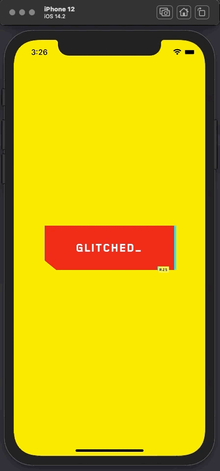

# Mobile Cyberbutton

A Cyberpunk77 style button on ios (and android eventually if I feel like it)

## Why?

In [CSS Cyberpunk 2077 Buttons - Taking your CSS to Night City](https://dev.to/jh3y/css-cyberpunk-2077-buttons-taking-your-css-to-night-city-43l0) 
author Jhey creates a Cyberpunk style button with CSS.

I wanted to try on mobile.

## iOS

[video](readme/cyberbutton.mp4)

Source: See class [CyberButton](ios/CyberBtn/CyberBtn/Sources/ViewController.swift#L66)

## Android

Eventually if I feel like it

Resources
https://lewismcgeary.github.io/posts/animated-vector-drawable-pathMorphing/
https://medium.com/androiddevelopers/playing-with-paths-3fbc679a6f77
https://medium.com/appkode/clipping-in-android-quickly-qualitatively-cheap-3ccfd31d5d6b
https://stackoverflow.com/questions/56607448/animating-a-clippath-from-ondraw

## LICENSE

[Unlicense](LICENSE)
